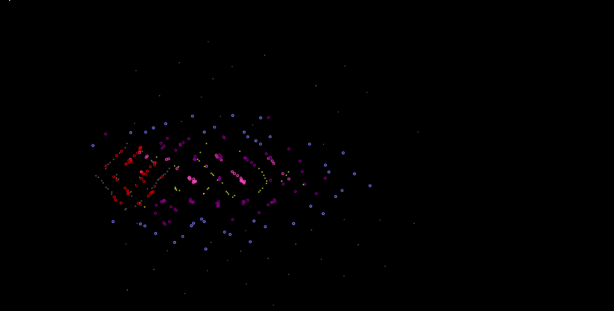
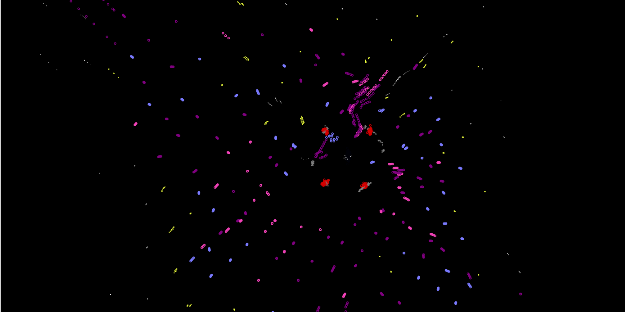

 
# Particle Sandbox

### [My GitHub](https://github.com/matildabrantley)
## Description
Explore a world of emergent 2D particle interactions formed from simple rules of attraction and repulsion of various particle types. Originally created Jan 2018.
## Table of Contents:
* [Features](#features)
* [Video](#video)
* [Screenshots](#screenshots)
* [License](#license)
* [Questions](#questions)

## Features 
Three real world forces loosely simulated:
* Gravity: Long-range attraction between particles or toward the ground.
* Electromagnetism: Medium-range attraction and repulsion between charged particles.
* Strong Nuclear: Short-range intense attraction between particles.
* Other custom forces exist to explore unique interactions and emergent effects not found in real quantum mechanics (or re-interpreting particles as living cells or organisms instead of fundamental particles).
 
Emergent interactions and atoms:
* When a charged medium-range force and a short-range stronger force operate at the same time, along with particles corresponding to different charge and mass, the result is an orbital shell similar to atoms. Tweaking the range and strength of the forces can result in multiple shells. Extra forces allow the user to witness what would happen in a hypothetical world with different physics.

Drag particles:
* Users can pull particles around with the mouse acting as a super heavy particle.

Trails: 
* Users can select trails to view the entire path of particles.

Add New Force or Particle:
* Users can create a new force or particle with specific interactions for every existing force or particle.
## Video

## Screenshots

## License
The project is licensed under the MIT License license.
## Questions
Here is a link to [my GitHub](https://github.com/matildabrantley) 
for access my other work.
